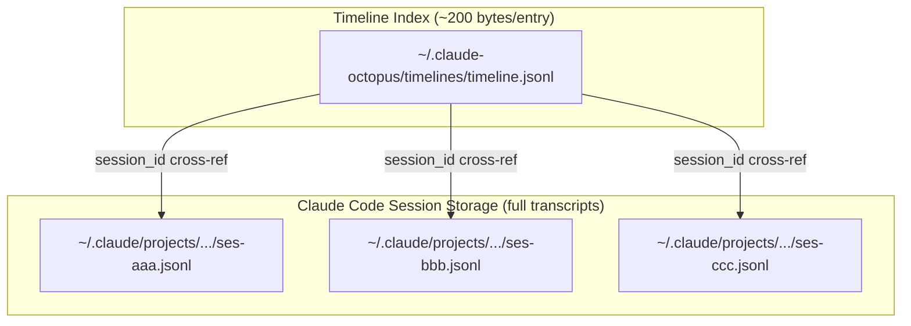
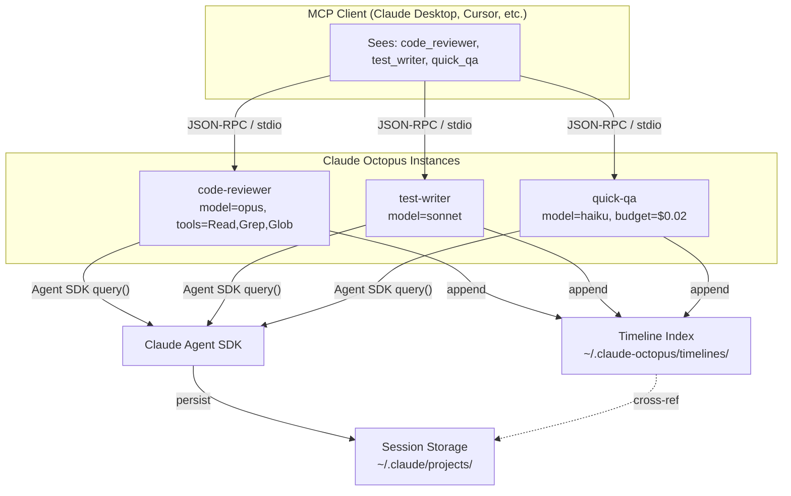

<p align="center">
  
</p>

# Claude Octopus

One brain, many arms.

An MCP server that wraps the [Claude Agent SDK](https://docs.anthropic.com/en/docs/claude-code/sdk), letting you run multiple specialized Claude Code agents — each with its own model, tools, system prompt, and personality — from any MCP client.

## Why

Claude Code is powerful. But one instance does everything the same way. Sometimes you want a **strict code reviewer** that only reads files. A **test writer** that defaults to TDD. A **cheap quick helper** on Haiku. A **deep thinker** on Opus.

Claude Octopus lets you spin up as many of these as you need. Same binary, different configurations. Each one shows up as a separate tool in your MCP client.

## Prerequisites

- **Node.js** >= 18
- **Claude Code** — the [Claude Agent SDK](https://www.npmjs.com/package/@anthropic-ai/claude-agent-sdk) is bundled as a dependency, but it spawns Claude Code under the hood, so you need a working `claude` CLI installation
- **Anthropic API key** (`ANTHROPIC_API_KEY` env var) or an active Claude Code OAuth session

## Install

```bash
npm install claude-octopus
```

Or skip the install entirely — use `npx` directly in your `.mcp.json` (see Quick Start below).

## Quick Start

The fastest way to get started:

```bash
npx claude-octopus init
```

This interactive wizard lets you pick a template, detects your MCP client, and writes the config for you.

Or add to your `.mcp.json` manually:

```json
{
  "mcpServers": {
    "claude": {
      "command": "npx",
      "args": ["claude-octopus@latest"],
      "env": {
        "CLAUDE_PERMISSION_MODE": "bypassPermissions"
      }
    }
  }
}
```

This gives you five tools:

| Tool | Purpose |
|------|---------|
| `claude_code` | Send a task, get a result |
| `claude_code_reply` | Continue a conversation |
| `claude_code_timeline` | Query the workflow timeline |
| `claude_code_transcript` | Read full session transcripts |
| `claude_code_report` | Generate HTML reports |

That's it — you have Claude Code as a tool, with full workflow observability built in.

## Multiple Agents

The real power is running several instances with different configurations:

```json
{
  "mcpServers": {
    "code-reviewer": {
      "command": "npx",
      "args": ["claude-octopus@latest"],
      "env": {
        "CLAUDE_TOOL_NAME": "code_reviewer",
        "CLAUDE_SERVER_NAME": "code-reviewer",
        "CLAUDE_DESCRIPTION": "Strict code reviewer. Finds bugs and security issues. Read-only.",
        "CLAUDE_MODEL": "opus",
        "CLAUDE_ALLOWED_TOOLS": "Read,Grep,Glob",
        "CLAUDE_APPEND_PROMPT": "You are a strict code reviewer. Report real bugs, not style preferences.",
        "CLAUDE_EFFORT": "high"
      }
    },
    "test-writer": {
      "command": "npx",
      "args": ["claude-octopus@latest"],
      "env": {
        "CLAUDE_TOOL_NAME": "test_writer",
        "CLAUDE_SERVER_NAME": "test-writer",
        "CLAUDE_DESCRIPTION": "Writes thorough tests with edge case coverage.",
        "CLAUDE_MODEL": "sonnet",
        "CLAUDE_APPEND_PROMPT": "Write tests first. Cover edge cases. TDD."
      }
    },
    "quick-qa": {
      "command": "npx",
      "args": ["claude-octopus@latest"],
      "env": {
        "CLAUDE_TOOL_NAME": "quick_qa",
        "CLAUDE_SERVER_NAME": "quick-qa",
        "CLAUDE_DESCRIPTION": "Fast answers to quick coding questions.",
        "CLAUDE_MODEL": "haiku",
        "CLAUDE_MAX_BUDGET_USD": "0.02",
        "CLAUDE_EFFORT": "low"
      }
    }
  }
}
```

Your MCP client now sees distinct tools for each agent — `code_reviewer`, `test_writer`, `quick_qa` — each purpose-built.

## Multi-Agent Orchestration

Agents can coordinate through a **coordinator pattern**: one agent has the others as inner MCP tools via `CLAUDE_MCP_SERVERS`, and its system prompt drives the pipeline.

```json
{
  "mcpServers": {
    "publishing-house": {
      "command": "npx",
      "args": ["claude-octopus@latest"],
      "env": {
        "CLAUDE_TOOL_NAME": "publishing_house",
        "CLAUDE_SERVER_NAME": "publishing-house",
        "CLAUDE_MODEL": "opus",
        "CLAUDE_PERMISSION_MODE": "bypassPermissions",
        "CLAUDE_APPEND_PROMPT": "You are a publishing house coordinator. Dispatch tasks to your specialist agents and drive the pipeline to completion.",
        "CLAUDE_MCP_SERVERS": "{\"researcher\":{\"command\":\"npx\",\"args\":[\"claude-octopus@latest\"],\"env\":{\"CLAUDE_TOOL_NAME\":\"researcher\",\"CLAUDE_SERVER_NAME\":\"researcher\",\"CLAUDE_MODEL\":\"sonnet\",\"CLAUDE_PERMISSION_MODE\":\"bypassPermissions\"}},\"architect\":{\"command\":\"npx\",\"args\":[\"claude-octopus@latest\"],\"env\":{\"CLAUDE_TOOL_NAME\":\"architect\",\"CLAUDE_SERVER_NAME\":\"architect\",\"CLAUDE_MODEL\":\"opus\",\"CLAUDE_PERMISSION_MODE\":\"bypassPermissions\"}}}"
      }
    }
  }
}
```

The coordinator agent autonomously calls `researcher`, `architect`, etc. as MCP tools — fully autonomous, no human in the loop until it finishes. Every invocation is tracked in the shared timeline.

## Agent Factory

Don't want to write configs by hand? Add a factory instance:

```json
{
  "mcpServers": {
    "agent-factory": {
      "command": "npx",
      "args": ["claude-octopus@latest"],
      "env": {
        "CLAUDE_FACTORY_ONLY": "true",
        "CLAUDE_SERVER_NAME": "agent-factory"
      }
    }
  }
}
```

This exposes a single `create_claude_code_mcp` tool — an interactive wizard. Tell it what you want ("a strict code reviewer that only reads files") and it generates the `.mcp.json` entry for you, listing all available options you can customize.

In factory-only mode, no query tools are registered — just the wizard. This keeps routing clean: the factory creates agents, the agents do work.

## Init Wizard

Don't want to edit JSON by hand? The init wizard gets you from zero to working in 30 seconds:

```bash
npx claude-octopus init
```

```
  Claude Octopus — init wizard

  One brain, many arms. Let's set up your agents.

Pick a template (or build your own):

  1. Code Review Team — Reviewer + test writer + security auditor
  2. Publishing House — Researcher + architect + editor + proofreader
  3. Tiered Models — Haiku for quick Q&A, Sonnet for coding, Opus for hard problems
  4. Solo Agent — Single Claude Code agent with sensible defaults
  5. Agent Factory — Interactive wizard that generates agent configs on demand
  6. Custom — describe your own agent(s)

Choice [1-6]:
```

It auto-detects installed MCP clients (Claude Desktop, Claude Code, Cursor, Windsurf), merges with existing config, and warns before overwriting.

### Skip the menu

```bash
npx claude-octopus init --template code-review-team
npx claude-octopus init --template tiered-models
npx claude-octopus init --template publishing-house
```

## Templates

Five built-in templates, battle-tested and ready to use:

| Template | Agents | Purpose |
|----------|--------|---------|
| `code-review-team` | code-reviewer (opus), test-writer (sonnet), security-auditor (opus) | Thorough code review pipeline |
| `publishing-house` | researcher (sonnet), architect (opus), editor (sonnet), proofreader (haiku) | Multi-stage content/code pipeline |
| `tiered-models` | quick-qa (haiku), coder (sonnet), deep-thinker (opus) | Right model for the job |
| `solo-agent` | claude (default) | Single agent, quick setup |
| `factory` | agent-factory | Generates configs on demand |

Each agent comes pre-tuned with appropriate model, tools, effort level, and system prompt.

## Dashboard

Monitor your agents in real time:

```bash
npx claude-octopus dashboard
```

Opens a local web dashboard at `http://localhost:3456` with:

- **Live stats** — total runs, invocations, cost, turns, errors
- **Recent activity** — agent cards for the latest run
- **Run table** — all runs with cost, duration, and status
- **Auto-refresh** — SSE connection pushes updates as agents run

```bash
# Custom port
npx claude-octopus dashboard --port 8080
```

The dashboard reads the same timeline index used by the `_timeline` and `_report` tools. No additional configuration needed.

## Tools

Each non-factory instance exposes:

| Tool | Purpose |
|------|---------|
| `<name>` | Send a task to the agent, get a response + `session_id` + `run_id` |
| `<name>_reply` | Continue a previous conversation by `session_id` |
| `<name>_timeline` | Query the cross-agent workflow timeline |
| `<name>_transcript` | Retrieve full session transcript from Claude Code's storage |
| `<name>_report` | Generate a self-contained HTML report for a run or all runs |

### Query and reply parameters

| Parameter | Description |
|-----------|-------------|
| `prompt` | The task or question (required) |
| `run_id` | Workflow run ID — groups related agent calls into one timeline. Auto-generated if omitted; returned in every response for propagation. |
| `cwd` | Working directory override |
| `model` | Model override (`sonnet`, `opus`, `haiku`, or full ID) |
| `tools` | Restrict available tools (intersects with server restriction) |
| `disallowedTools` | Block additional tools (unions with server blacklist) |
| `additionalDirs` | Extra directories the agent can access |
| `plugins` | Additional plugin paths to load |
| `effort` | Thinking effort (`low`, `medium`, `high`, `max`) |
| `permissionMode` | Permission mode (can only tighten, never loosen) |
| `maxTurns` | Max conversation turns |
| `maxBudgetUsd` | Max spend in USD |
| `systemPrompt` | Additional prompt (appended to server default) |

## Timeline

Every agent invocation is recorded in a lightweight JSONL index at `~/.claude-octopus/timelines/timeline.jsonl`. This solves the multi-agent correlation problem: when several agents participate in a workflow, the timeline tracks which sessions belong to the same run, in what order they executed, and what role each played.

Full session transcripts stay in Claude Code's own storage (`~/.claude/projects/`). The timeline is just the table of contents — ~200 bytes per entry — that cross-references via `session_id`.



### How it works

1. Every `<name>` and `<name>_reply` call appends one line to the timeline
2. If you pass `run_id`, all agents sharing the same `run_id` are grouped into one run
3. If you omit `run_id`, one is auto-generated and returned in the response — pass it to subsequent agents to keep them grouped

### Querying the timeline

```
# List all runs
<name>_timeline({})

# Show one run's agent sequence
<name>_timeline({ run_id: "abc-123" })

# Look up a specific session
<name>_timeline({ session_id: "ses-xyz" })

# Retrieve full transcript (separate tool)
<name>_transcript({ session_id: "ses-xyz" })
```

### Multi-agent workflow example

```
Host:  researcher({ prompt: "Research X", run_id: "pub-001" })
       → { run_id: "pub-001", session_id: "ses-aaa", result: "..." }

Host:  architect({ prompt: "Structure based on...", run_id: "pub-001" })
       → { run_id: "pub-001", session_id: "ses-bbb", result: "..." }

Host:  verifier({ prompt: "Check this plan", run_id: "pub-001" })
       → { run_id: "pub-001", session_id: "ses-ccc", result: "..." }

Later: researcher_timeline({ run_id: "pub-001" })
       → [
           { agent: "researcher", session_id: "ses-aaa", cost: 0.05, turns: 4 },
           { agent: "architect",  session_id: "ses-bbb", cost: 0.08, turns: 6 },
           { agent: "verifier",   session_id: "ses-ccc", cost: 0.03, turns: 3 },
         ]

Later: researcher_transcript({ session_id: "ses-aaa" })
       → full conversation transcript from Claude Code's storage
```

## HTML Reports

Generate self-contained HTML reports with agent sequence visualization, cost breakdown, and collapsible transcripts. Dark theme, no external dependencies — one file, open in any browser.

### Via MCP tool

```
<name>_report({})                        # index of all runs
<name>_report({ run_id: "pub-001" })     # detailed report for one run
```

### Via CLI

```bash
# Index of all runs
npx claude-octopus report --out index.html

# Detailed report for one run
npx claude-octopus report pub-001 --out report.html
open report.html

# Without transcripts (faster, smaller file)
npx claude-octopus report pub-001 --no-transcripts --out report.html

# To stdout (pipe-friendly)
npx claude-octopus report pub-001 > report.html
```

### What's in the report

- **Run summary** — agent count, total cost, duration, total turns
- **Timeline bar** — numbered dots for each agent (green = success, red = error)
- **Agent cards** — timing, cost, turns, session ID, prompt excerpt
- **Collapsible transcripts** — full tool calls, reasoning, and results per agent

## Configuration

All configuration is via environment variables in `.mcp.json`. Every env var is optional.

### Identity

| Env Var | Description | Default |
|---------|-------------|---------|
| `CLAUDE_TOOL_NAME` | Tool name prefix (generates `<name>`, `<name>_reply`, `<name>_timeline`, `<name>_transcript`, `<name>_report`) | `claude_code` |
| `CLAUDE_DESCRIPTION` | Tool description shown to the host AI | generic |
| `CLAUDE_SERVER_NAME` | MCP server name in protocol handshake | `claude-octopus` |
| `CLAUDE_FACTORY_ONLY` | Only expose the factory wizard tool | `false` |

### Agent

| Env Var | Description | Default |
|---------|-------------|---------|
| `CLAUDE_MODEL` | Model (`sonnet`, `opus`, `haiku`, or full ID) | SDK default |
| `CLAUDE_CWD` | Working directory | `process.cwd()` |
| `CLAUDE_PERMISSION_MODE` | `default`, `acceptEdits`, `bypassPermissions`, `plan` | `default` |
| `CLAUDE_ALLOWED_TOOLS` | Comma-separated tool restriction (available tools) | all |
| `CLAUDE_DISALLOWED_TOOLS` | Comma-separated tool blacklist | none |
| `CLAUDE_MAX_TURNS` | Max conversation turns | unlimited |
| `CLAUDE_MAX_BUDGET_USD` | Max spend per invocation | unlimited |
| `CLAUDE_EFFORT` | `low`, `medium`, `high`, `max` | SDK default |

### Prompts

| Env Var | Description |
|---------|-------------|
| `CLAUDE_SYSTEM_PROMPT` | Replaces the default Claude Code system prompt |
| `CLAUDE_APPEND_PROMPT` | Appended to the default prompt (usually what you want) |

### Advanced

| Env Var | Description |
|---------|-------------|
| `CLAUDE_ADDITIONAL_DIRS` | Extra directories to grant access (comma-separated) |
| `CLAUDE_PLUGINS` | Local plugin paths (comma-separated) |
| `CLAUDE_MCP_SERVERS` | MCP servers for the inner agent (JSON) |
| `CLAUDE_PERSIST_SESSION` | `true`/`false` — enable session resume (default: `true`) |
| `CLAUDE_SETTING_SOURCES` | Settings to load: `user`, `project`, `local` |
| `CLAUDE_SETTINGS` | Path to settings JSON or inline JSON |
| `CLAUDE_BETAS` | Beta features (comma-separated) |

### Timeline

| Env Var | Description | Default |
|---------|-------------|---------|
| `CLAUDE_TIMELINE_DIR` | Directory for the cross-agent timeline index | `~/.claude-octopus/timelines` |

### Authentication

| Env Var | Description | Default |
|---------|-------------|---------|
| `ANTHROPIC_API_KEY` | Anthropic API key for this agent | inherited from parent |
| `CLAUDE_CODE_OAUTH_TOKEN` | Claude Code OAuth token for this agent | inherited from parent |

Leave both unset to inherit auth from the parent process. Set one per agent to use a different account or billing source.

Lists accept JSON arrays when values contain commas: `["path,with,comma", "/normal"]`

## Security

- **Permission mode defaults to `default`** — tool executions prompt for approval unless you explicitly set `bypassPermissions`.
- **`cwd` overrides preserve agent knowledge** — when the host overrides `cwd`, the agent's configured base directory is automatically added to `additionalDirectories` so it retains access to its own context.
- **Tool restrictions narrow, never widen** — per-invocation `tools` intersects with the server restriction (can only remove tools, not add). `disallowedTools` unions (can only block more).
- **`_reply` and `_transcript` tools respect persistence** — not registered when `CLAUDE_PERSIST_SESSION=false`.
- **Timeline writes are best-effort** — a failed timeline append never blocks or fails the primary query.

## Architecture



## How It Compares

| Feature | Built-in `claude` | [claude-code-mcp](https://github.com/steipete/claude-code-mcp) | **Claude Octopus** |
|---------|-------------------|----------------------------------------------------------------|--------------------|
| Approach | Built-in | CLI wrapping | Agent SDK |
| Tools per instance | 16 raw tools | 1 prompt tool | 5 (prompt, reply, timeline, transcript, report) |
| Multi-instance | No | No | Yes |
| Per-instance config | No | No | Yes (20 env vars) |
| Init wizard | No | No | Yes (`init` + 5 templates) |
| Factory wizard | No | No | Yes |
| Session continuity | No | No | Yes |
| Cross-agent timeline | No | No | Yes |
| Web dashboard | No | No | Yes (live, SSE) |
| HTML reports | No | No | Yes |

## Development

```bash
pnpm install
pnpm build       # compile TypeScript
pnpm test        # run tests (vitest)
pnpm test:coverage  # coverage report
```

## License

[ISC](https://github.com/xiaolai/claude-octopus/blob/main/LICENSE) - Xiaolai Li
